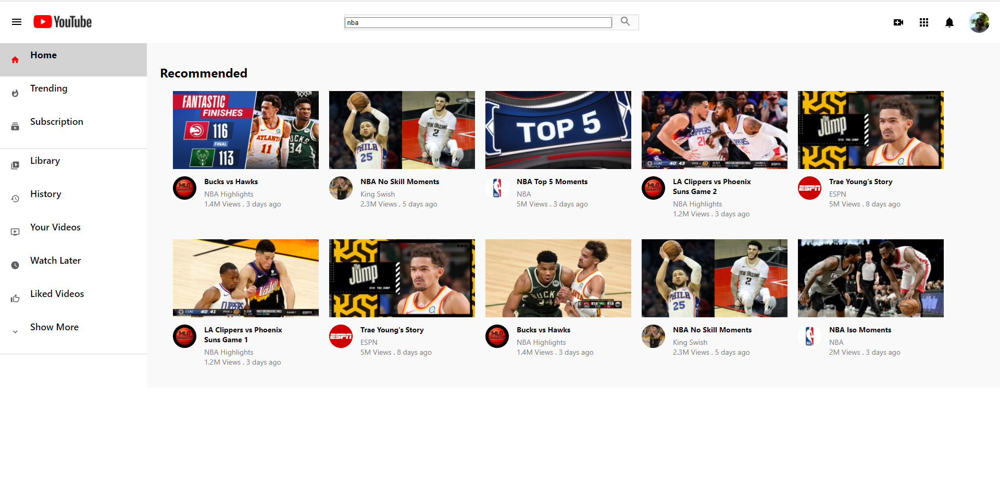
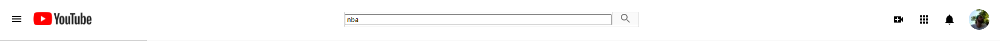

<h1 align="center">
  
   
  Youtube Clone Built Using React.JS & Firebase
</h1>

  This is a clone of Youtube website built using <strong><em>React.JS</em></strong> and <strong><em>Firebase</em></strong>. It's not a fully functional clone it doesn't have all the features of Youtube website. it's a similar version of Youtube to show my Front-end abilities in React.JS mostly. It contains the home page and the search page.
     
  <strong><em>This is the live version:</em></strong> https://clone-de160.web.app/

  
  # Home Page
  
 

   

# Header

Clicking on the Youtube icon takes you back to the homepage.

 

   

